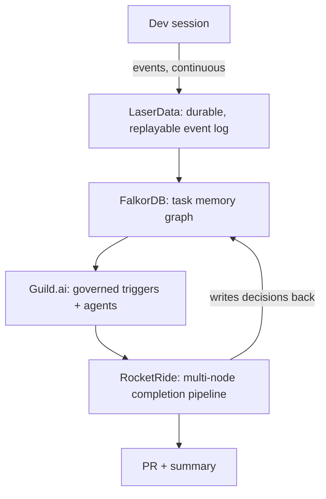

# Relay

**Memory Meets Motion — Hackathon, Frontier Tower SF, Aug 3 2026**
Track partners: RocketRide.ai · Guild.ai · LaserData · FalkorDB

> **Setting up on a new machine?** See [SETUP.md](SETUP.md) — credentials,
> FalkorDB, the Guild CLI and everything else git does not carry.

## One-liner

Relay remembers exactly why you did what you did, and finishes the task while you're gone.

## The problem

Work stalls the moment a person steps away from it. A dev context-switches, hits EOD, or hands
off across timezones, and everything that made the next step obvious — why an approach was
chosen, what was tried and failed, what's actually left — evaporates. The next person (or the
same person tomorrow) has to reconstruct it from a diff and a vague commit message. That
reconstruction tax is most of what makes "picking up someone else's work" slow.

## The idea

Every meaningful action during a work session is captured as a durable, replayable event. A live
knowledge graph is built from that stream — not just what changed, but the task's structure:
steps, decisions, blockers, dependencies. When the session pauses, a governed agent wakes up,
reads the graph and the event tail, and finishes the work itself — opening a PR that explains
exactly what it inherited and what it did.

## Architecture



## Why each sponsor is load-bearing, not decorative

Full matrix with exact counts and checkboxes is in `EXECUTION.md` → Section 1. Summary:

| Sponsor | Role | Touchpoints |
|---|---|---|
| LaserData | Durable, replayable event backbone | 3 streams, 2 consumer roles, replay-by-offset |
| FalkorDB | Live task memory graph | Continuous writes, 3 distinct query patterns, per-task multi-tenant graphs, agent write-back |
| Guild.ai | Governance, triggers, audit | 3 agents, 2 triggers, 3+ audited sessions |
| RocketRide | Execution engine | 2 pipelines, 6–7 node DAG, multi-model routing, retry loop |

## Repo structure

```
relay/
  README.md
  AGENTS.md              # brief Codex reads every session
  EXECUTION.md           # step-by-step build plan + live execution log
  CHANGELOG.md           # every change gets recorded here
  .env.example
  .gitignore
  execution/             # three parallel owner task logs
  capture/               # session simulator + LaserData publishers
  memory/                # LaserData -> FalkorDB consumer, Cypher queries
  orchestration/         # Guild agents + triggers
  pipeline/              # RocketRide pipeline definitions
  demo/                  # demo script, backup recording, fixtures
```

## Parallel execution tracks

Three builders can work at the same time without stepping on each other:

| Track | Tool | Primary ownership | Execution file |
|---|---|---|---|
| Capture + Memory | Claude Code #1 | LaserData L1/L2, FalkorDB F1-F5, shared replay/query contracts | [`execution/CLAUDECODE_1_CAPTURE_MEMORY.md`](execution/CLAUDECODE_1_CAPTURE_MEMORY.md) |
| Orchestration + Pipelines | Claude Code #2 | Guild.ai G1-G3, RocketRide R1/R2, LaserData L3, FalkorDB F6 | [`execution/CLAUDECODE_2_ORCHESTRATION_PIPELINE.md`](execution/CLAUDECODE_2_ORCHESTRATION_PIPELINE.md) |
| Integration + Demo + Release | Codex | End-to-end demo, evidence trail, changelog, deck inputs, final push | [`execution/CODEX_3_INTEGRATION_DEMO.md`](execution/CODEX_3_INTEGRATION_DEMO.md) |

Every track keeps its own task log, updates `CHANGELOG.md` for changed files, and appends real
runtime evidence to `EXECUTION.md` Section 4 when a sponsor touchpoint is completed.

## Setup

1. `git init` (if not already)
2. Install SDKs — see `AGENTS.md` → Stack for exact packages
3. Copy `.env.example` to `.env` and fill in sponsor credentials (never commit `.env`)
4. Run `codex` in this directory — it reads `AGENTS.md` and `EXECUTION.md` and starts on Phase 0

## Demo (60 seconds)

1. The presence monitor watches camera motion plus mouse, click, keyboard, and tab activity while the dev works on `/api/checkout`.
2. The dev hits the exact 1000 ms token-bucket refill bug, then physically leaves or clicks "Simulate leaving."
3. Relay emits a `developer_absent` handoff event and switches the UI from watching mode into autopilot mode.
4. Guild.ai starts the governed `relay-resume` agent, and RocketRide runs fetch, replay, reason, edit, test retry, PR, and notify nodes.
5. The PR explains what Relay inherited, what it fixed, and which sponsor-backed evidence proves the handoff.

Run the local presence gate:

```sh
npm run demo:autopilot
```

Then open `http://localhost:4173`.

## Status

Build in progress — see `EXECUTION.md` for the live log.
